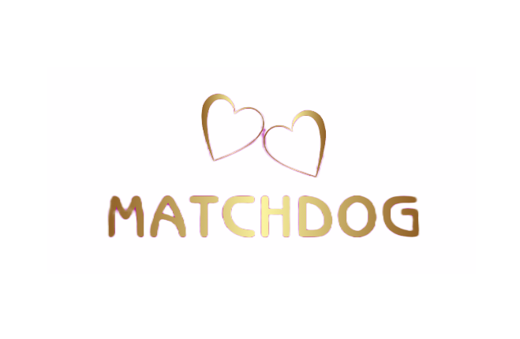

# MatchDog

Welcome to MatchDog, a platform for dog lovers to connect and find playmates for their furry friends.

## Description

MatchDog is a web application designed to help dog owners find compatible playmates for their dogs. It provides a platform where users can create profiles for their dogs, search for other dogs based on various criteria, and connect with other dog owners to arrange playdates.


---
 


---
 

 ---
 
 ---
 

 ---
 
  ---
 
  ---
 

---
## Table of Contents
- **Features**
- **Technologies Used**
- **Folder Structure**
- **Data Structure**
- **API Endpoints**
- **Frontend Components**
- **Backend Components**
- **Setup and Usage**
- **Contributors**
- **Contact**

## Features

- **Dog Profiles**: Users can create profiles for their dogs, including details such as breed, age, size, and personality traits.
- **Match**: Users can search for other dogs based on location, breed, size, and compatibility with their own dog.
- **Matching Algorithm**: MatchDog employs a matching algorithm that suggests potential playmates for a user's dog based on compatibility factors.
- **Messaging**: Users can communicate with other dog owners through messaging to arrange playdates or ask questions.
- **User Authentication**: MatchDog provides user authentication and secure login functionality.
- **Responsive Design**: The web application is designed to be responsive, providing an optimal user experience across different devices and screen sizes.

---
## Getting Started

To get started with MatchDog, follow the instructions below:
1. Install the dependencies: `npm install`
2. Start the development server: `npm start`
3. Open your web browser and navigate to `http://localhost:3000` to access the application.

---

- **Folder Structure**

The repository has the following folder structure:

- **Public**: Contains the public assets and index.html file.
- **Src**: Contains the source code of the React application.
  - **Components**: Contains reusable components used throughout the application.
  - **Pages**: Contains the main pages of the application.
  - **Styles**: Contains global styles and styled components.
  - **Contexts**: Contains React context providers.
  - **Images**: Contains images used in the application.
  - **Footer.js**: Represents the footer section of a web page. It typically contains information such as contact details.
- **Server** : Contains the backend code.
   - **route** : Contains the API routes and handlers.
   - **API**: Contains API endpoints and data retrieval functions.
---
## Technologies Used

- **Frontend**: React, HTML, CSS, JavaScript
- **Backend**: Node.js, Express.js
- **Database**: MongoDB

I have chosen these technologies based on their suitability for web development and their ability to handle the desired functionalities efficiently.
---
## API Endpoints

MatchDog utilizes API endpoints to handle various functionalities. Here are the available endpoints:

- **GET /api/dogs**: Retrieve all dogs available for matching.
- **GET /api/users**: Retrieve all users .
- **GET /api/user/:userId**: Retrieve users with a specific Id  .
- **GET /api/dogs/:id**: Retrieve details of a specific dog.
- **POST /api/dog-profile**: Create a new dog to the database.
- **POST /api/login-or-signup**: Create a new login.
- **PUT /api/dogs/:id**: Update the details of a specific dog.
- **DELETE /api/dogs/:dogId/:userId**: Delete a dog and the user from the database.

These endpoints facilitate dog retrieval, creation, updating, and deletion, as well as matching and messaging functionalities.


## About the Data

The application utilizes JSON data to populate the product and company information. Here's an example of the JSON structure for the companies:

### Dog Object

```js
{
  "name": "Buddy",
  "breed": "Labrador Retriever",
  "age": 3,
  "size": "Large",
  "location": "New York",
  "ownerId": "12345",
  "imageSrc": "https://example.com/dog-image.jpg",
  "description": "Friendly and playful Labrador looking for friends!",
  "createdAt": "2023-06-15T09:00:00.000Z",
  "updatedAt": "2023-06-20T14:30:00.000Z"
}

```

### User Object

```js
{
  "name": "John Doe",
  "email": "john@example.com",
  "dogs": ["dogId1", "dogId2"],
  "createdAt": "2023-06-10T12:00:00.000Z",
  "updatedAt": "2023-06-20T14:30:00.000Z"
}

  ```
 ## Setup and Usage
 Set up the environment variables by creating a .env file in the server directory and adding the following variables:

- **MONGODB_URI**: MongoDB connection string.
- **AUTH0_DOMAIN**: Auth0 domain for authentication.
- **AUTH0_AUDIENCE**: Auth0 audience for authentication.
- **AUTH0_CLIENT_ID**: Auth0 client ID for authentication.
- **AUTH0_CLIENT_SECRET**: Auth0 client secret for authentication.

## Extra Features

- **ChatBox**: Represents a chat conversation with another user.
- **Location**: google Map to view nearby parks
 


Thank you for your interest in the MatchDog project.I hope you and your furry friends have a pawsome experience! If you have any questions, feedback, or suggestions, please feel free to reach out. 


## Sanam Saadi
Best regards,
MachDog! 