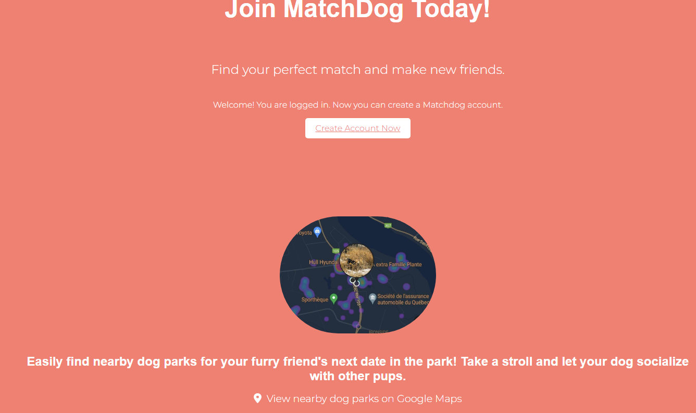

# MatchDog

Welcome to MatchDog, a platform for dog lovers to connect and find playmates for their furry friends.

## Description

MatchDog is a web application designed to help dog owners find compatible playmates for their dogs. It provides a platform where users can create profiles for their dogs, search for other dogs based on various criteria, and connect with other dog owners to arrange playdates.


---
 


---
 

 ---
 
 ---
 

 ---
 
  ---
 
  ---
 

---
## Features

- **Dog Profiles**: Users can create profiles for their dogs, including details such as breed, age, size, and personality traits.
- **Match**: Users can search for other dogs based on location, breed, size, and compatibility with their own dog.
- **Matching Algorithm**: MatchDog employs a matching algorithm that suggests potential playmates for a user's dog based on compatibility factors.
- **Messaging**: Users can communicate with other dog owners through messaging to arrange playdates or ask questions.
- **User Authentication**: MatchDog provides user authentication and secure login functionality.
- **Responsive Design**: The web application is designed to be responsive, providing an optimal user experience across different devices and screen sizes.

---
## Getting Started

To get started with MatchDog, follow the instructions below:
1. Install the dependencies: `npm install`
2. Start the development server: `npm start`
3. Open your web browser and navigate to `http://localhost:3000` to access the application.

---

- **Folder Structure**

The repository has the following folder structure:

- **Public**: Contains the public assets and index.html file.
- **Src**: Contains the source code of the React application.
  - **Components**: Contains reusable components used throughout the application.
  - **Pages**: Contains the main pages of the application.
  - **Styles**: Contains global styles and styled components.
  - **API**: Contains API endpoints and data retrieval functions.
  - **Contexts**: Contains React context providers.
  - **Images**: Contains images used in the application.
---
## Technologies Used

- **Frontend**: React, HTML, CSS, JavaScript
- **Backend**: Node.js, Express.js
- **Database**: MongoDB

We have chosen these technologies based on their suitability for web development and their ability to handle the desired functionalities efficiently.
---
## API Endpoints

MatchDog utilizes API endpoints to handle various functionalities. Here are the available endpoints:

- **GET /api/dogs**: Retrieve all dogs available for matching.
- **GET /api/users**: Retrieve all users .
- **GET /api/user/:userId**: Retrieve users with a specific Id  .
- **GET /api/dogs/:id**: Retrieve details of a specific dog.
- **POST /api/dog-profile**: Create a new dog to the database.
- **POST /api/login-or-signup**: Create a new login.
- **PUT /api/dogs/:id**: Update the details of a specific dog.
- **DELETE /api/dogs/:dogId/:userId**: Delete a dog and the user from the database.

These endpoints facilitate dog retrieval, creation, updating, and deletion, as well as matching and messaging functionalities.


## About the Data

The application utilizes JSON data to populate the product and company information. Here's an example of the JSON structure for the companies:

### Item Object

```js
  {
    "name": "Barska GB12166 Fitness Watch with Heart Rate Monitor",
    "price": "$49.99",
    "body_location": "Wrist",
    "category": "Fitness",
    "id": 6543,
    "imageSrc": "data:image/jpeg;base64,/9j/4AAQSkZJRgABAQAAAQABAAD/2wCEAAkGBwgHB...<REST_OF_IMAGE_ENCODING>",
    "numInStock": 9,
    "companyId": 19962
  },
```

### Company Object

```js
  {
    "name": "Bowflex",
    "url": "http://www.bowflex.com/",
    "country": "United States",
    "_id": 11385
  },
  {
    "name": "Casio",
    "url": "http://www.casio.com",
    "country": "Japan",
    "_id": 13334
  },
  ```


## API Endpoints
To support the desired functionalities of our e-commerce website, our backend will provide a set of RESTful endpoints. Here are the available endpoints:

- GET /api/get-items: Retrieve all items available for sale.
- GET /api/item/:itemId: Retrieve details of a specific item.
- GET /api/get-companies: Retrieve all companies associated with the items.
- GET /api/company/:companyId: Retrieve details of a specific company.
- GET /api/cart: Retrieve the user's cart with all the items in it.
- POST /api/add-item-to-cart: Add an item to the user's cart.
- DELETE /api/delete-items: Delete one item from the user's cart.
- DELETE /api/delete-AllItems: Delete all items from the user's cart.
- PATCH /api/update-item-quantity: Update the quantity of an item in the user's cart.
- POST /api/purchase-item: Purchase items from the user's cart.
- GET /api/purchases: Retrieve all purchases made by the user.
- GET /api/purchase/:purchaseId: Retrieve details of a specific purchase.

These endpoints cover essential functionalities such as retrieving items, managing the cart, making purchases, and viewing purchase history.

## Backend Components

- **getItems.js**: This component handles the HTTP GET request to /api/get-items and retrieves all the items available for sale. It fetches the items from the database and returns them in the response.
- **getItem.js**: This component handles the HTTP GET request to /api/item/:itemId and retrieves the details of a specific item. It takes the itemId as a parameter, fetches the corresponding item from the database, and returns its details in the response.
- **getCompanies.js**:  This component handles the HTTP GET request to /api/get-companies and retrieves all the companies associated with the items. It fetches the companies from the database and returns them in the response.
- **getCompany.js**:  This component handles the HTTP GET request to /api/company/:companyId and retrieves the details of a specific company. It takes the companyId as a parameter, fetches the corresponding company from the database, and returns its details in the response.
- **getCart.js**:  This component handles the HTTP GET request to /api/cart and retrieves the user's cart with all the items in it. It fetches the cart from the database based on the user's authentication or session, and returns it in the response.
- **addItemToCart.js**:  This component handles the HTTP POST request to /api/add-item-to-cart and adds an item to the user's cart. It receives the item details in the request body, performs necessary validations, checks if the item is already in the cart, and adds it to the cart in the database.
- **deleteItemFromCart.js**:  This component handles the HTTP DELETE request to /api/delete-items and deletes one item from the user's cart. It receives the item details to be deleted in the request body or as a parameter, checks if the item exists in the cart, and removes it from the cart in the database.
- **deleteAllItemsFromCart.js**: This component handles the HTTP DELETE request to /api/delete-AllItems and deletes all items from the user's cart. It removes all items from the cart in the database based on the user's authentication or session.
- **updateItemQuantityCart.js**: This component handles the HTTP PATCH request to /api/update-item-quantity and updates the quantity of an item in the user's cart. It receives the updated quantity and the item details in the request body, checks if the item exists in the cart, and updates its quantity in the cart in the database.
- **purchaseFromCart.js**:  This component handles the HTTP POST request to /api/purchase-item and allows the user to purchase items from their cart. It processes the purchase, deducts the purchased items from the stock, creates a new purchase record, and returns a confirmation of the purchase in the response.
- **getPurchases.js**:  This component handles the HTTP GET request to /api/purchases and retrieves all purchases made by the user. It fetches the user's purchase history from the database based on their authentication or session and returns the purchases in the response.
- **getPurchase.js**: This component handles the HTTP GET request to /api/purchase/:purchaseId and retrieves the details of a specific purchase. It takes the purchaseId as a parameter, fetches the corresponding purchase record from the database, and returns its details in the response.

These backend components are responsible for handling various API endpoints related to retrieving items, managing the cart, making purchases, and retrieving purchase history.

## Frontend Components
- **AllProducts.js**: Represents a page displaying all the available product categories. It provides a visually appealing layout with a hero section and a category tab component.
- **ProductDetails.js**: Displays the details of a specific product. It fetches the product details and the corresponding company details from the server and renders them on the screen. Users can add the product to their cart by specifying the quantity.
- **CategoryContext.js**: Responsible for providing the category state and the setCategory function to its child components.
- **categoryTab.js**: Responsible for displaying a tabbed interface for different categories and rendering products based on the selected category. It utilizes the useContext and useState hooks from React to manage category state and fetch items data.
- **Company.js**: Responsible for rendering information about a specific company. It utilizes the useParams hook from React Router to access the company ID from the URL parameters.
- **Discover.js**: Renders a container with a title and a list of categories.Each category is represented by a clickable element that triggers a category change and navigation to the corresponding category page.The component also logs the category state change and the current category value to the console for debugging purposes.
- **Header.js**: Represents the header section of the application. It includes the brand title, navigation buttons, search functionality, and a cart button.
- **Home.js**: Represents the landing page of the application. It displays various sections, such as a top section with a featured image and best-selling items, a moving banner with company logos, a discover section, and an about us section.
- **MovingBanner.js**: Displays a horizontal scrolling banner with logos of different companies. Clicking on a logo navigates the user to the corresponding company's page.
- **Cart.js**: Display a list of items added to the cart.Allow users to increase or decrease the quantity of an item.Display the total order amount based on the selected items.Empty the cart when there are no items present.
- **Confirmation.js**: Display a confirmation page with the details of the purchased items.Show the name, image, price, and quantity of each purchased item.Provide a "Go to Homepage" button for users to continue shopping.
- **AboutUs.js**: Provides information about the vision of the project and introduces the team members behind it.
- **Footer.js**: Represents the footer section of a web page. It typically contains information such as contact details.


## Extra Features

- **Moving Banners**: Engaging banners on the website that showcase special promotions, new arrivals, or featured products.
- **Filter** by Category: Users can easily filter items by category to narrow down their search and find specific types of wearable items.
- **Search Bar** by Category: Users can use a search bar specifically designed to search for items within a selected category. 


Thank you for showing interest in GadgetGo project. Our team is thrilled to present this application to you. If you have any questions, feedback, or suggestions, please feel free to reach out. We are here to assist you.

## Our Team
- Jasmine Poliquin 
- Gabriel Gosselin
- Karam Hamwi 
- Nishteman Saadi 
- Emma Van Voorst

We have put in our best efforts to create a seamless and enjoyable shopping experience for you. We hope you find our selection of wearable products appealing and our platform user-friendly.

Happy exploring and shopping!

Best regards,
GadgetGo Team!